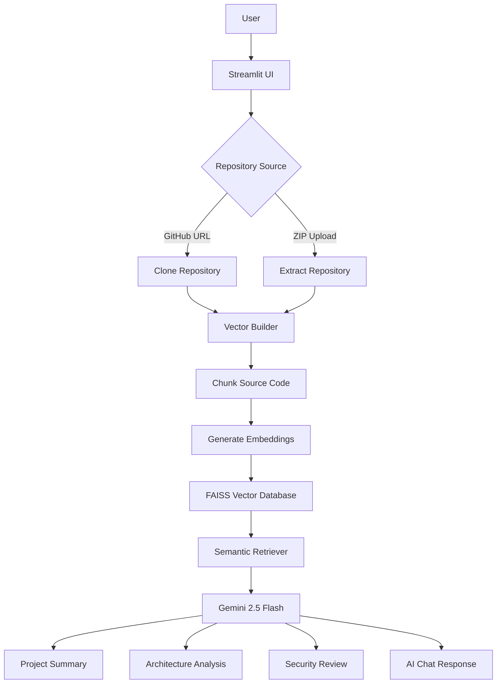

# 🤖 AI Codebase Assistant

### AI-powered Repository Analysis using Gemini 2.5 Flash + RAG + FAISS

Analyze any GitHub repository or ZIP project, generate project summaries, architecture diagrams, security reviews, and chat with the codebase using Generative AI.

---

# 🌐 Live Demo

🚀 **Try the application online**

**https://ai-codebase-assistant-auxgljsrmwgncggieazmwu.streamlit.app/**

---

# 📖 Overview

AI Codebase Assistant is an intelligent software engineering assistant that helps developers quickly understand unfamiliar codebases using Retrieval-Augmented Generation (RAG).

Instead of manually reading hundreds of source files, users can upload a ZIP repository or analyze a public GitHub repository. The application indexes the source code using semantic embeddings and enables natural language interaction with the project.

Beyond conversational code exploration, the assistant can automatically generate:

- 📋 Project Summary
- 🏗 Software Architecture
- 🔒 Security Review
- 💬 AI-powered Codebase Chat

The goal is to significantly reduce onboarding time for developers working with new projects.

---

# ✨ Features

## 🌐 Repository Analysis

- Analyze any public GitHub repository
- Upload ZIP repositories
- Automatic repository indexing

## 🤖 AI Assistant

- Chat with any codebase
- Context-aware responses
- Semantic code search

## 📊 Automated Documentation

- Generate project summaries
- Explain architecture
- Security review
- Source code retrieval

## ⚡ Performance

- FAISS Vector Database
- HuggingFace Embeddings
- Gemini 2.5 Flash
- Optimized retrieval pipeline

---
# 🏗 System Architecture

---